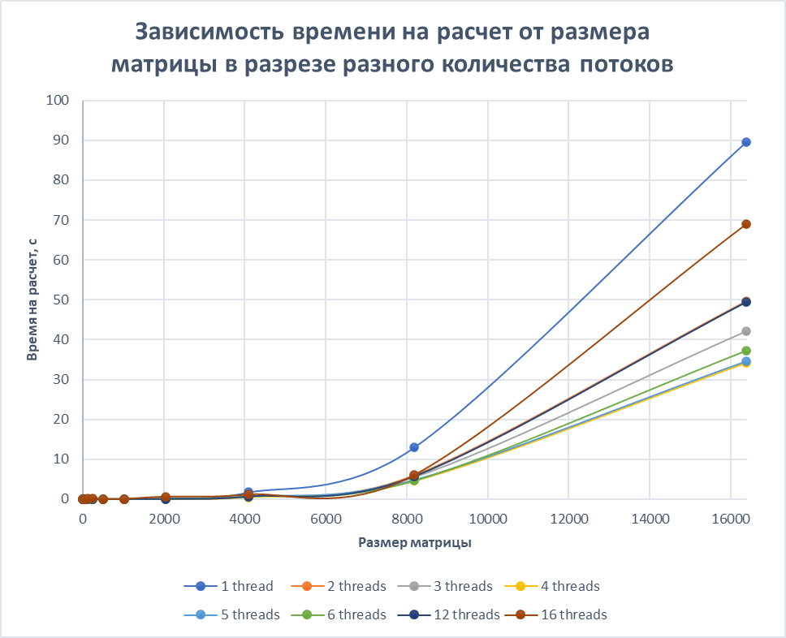
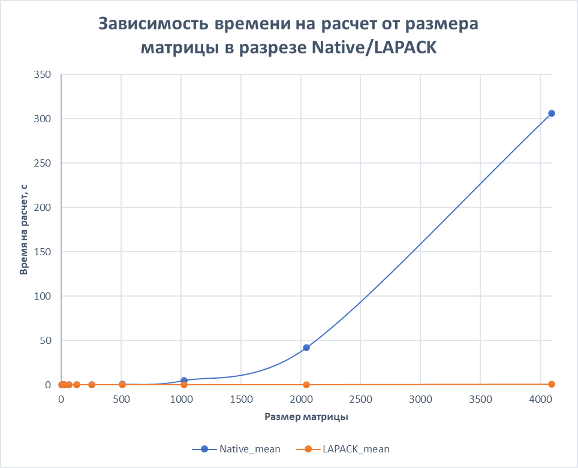
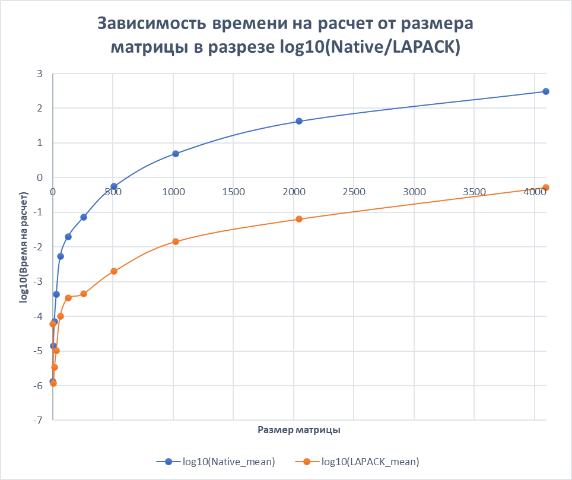

# Какие тесты проводились?

**Важные характиристики тачки = 12 ядер, 16 лог процессоров**

## Тест только LAPACK части

### Входные параметры

1. Запускал только LAPACK (`--env RUN_ONLY_LAPACK=1`)
2. Тесты происходили на сетке от 4 до 16384 стороны матрицы (`--env SET_SIZES=13`)
3. 5 итераций на одной стороне (`--env SET_ITERATIONS = 5`)
4. Менял количество потоков `n = {1, 2, 3, 4, 5, 6, 12, 16}` (`--env SET_THREADS=n`)

### Результаты

**Берем только mean значения и получаем следующую табличку:**
| Size  | 1 thread | 2 threads | 3 threads | 4 threads | 5 threads | 6 threads | 12 threads | 16 threads |
|-------|----------|-----------|-----------|-----------|-----------|-----------|------------|------------|
| 4     | 2,32E-05 | 3,74E-05  | 3,57E-05  | 1,78E-04  | 5,41E-05  | 2,60E-05  | 3,09E-05   | 9,55E-06   |
| 8     | 5,05E-06 | 6,35E-06  | 2,17E-06  | 8,17E-06  | 9,69E-06  | 6,73E-06  | 1,26E-05   | 1,31E-06   |
| 16    | 1,51E-05 | 1,28E-05  | 6,02E-06  | 3,31E-05  | 3,53E-05  | 2,24E-05  | 2,07E-05   | 4,11E-06   |
| 32    | 2,81E-05 | 1,52E-04  | 1,50E-05  | 3,37E-05  | 4,67E-05  | 6,60E-05  | 8,63E-05   | 1,29E-05   |
| 64    | 1,01E-04 | 2,14E-04  | 1,28E-03  | 3,89E-04  | 5,65E-04  | 1,40E-04  | 2,77E-04   | 1,34E-04   |
| 128   | 4,97E-04 | 1,29E-03  | 9,11E-04  | 6,52E-03  | 7,72E-03  | 6,64E-03  | 2,16E-02   | 1,83E-01   |
| 256   | 1,04E-03 | 9,78E-04  | 7,84E-03  | 4,32E-03  | 6,08E-03  | 6,73E-03  | 4,95E-03   | 1,29E-01   |
| 512   | 5,06E-03 | 9,22E-03  | 4,98E-03  | 3,34E-03  | 2,88E-03  | 2,67E-03  | 3,51E-03   | 4,07E-02   |
| 1024  | 2,95E-02 | 1,68E-02  | 1,68E-02  | 1,61E-02  | 1,18E-02  | 1,27E-02  | 1,71E-02   | 8,15E-02   |
| 2048  | 1,86E-01 | 8,94E-02  | 8,96E-02  | 1,01E-01  | 7,74E-02  | 8,27E-02  | 8,15E-02   | 6,18E-01   |
| 4096  | 1,77E+00 | 8,02E-01  | 6,12E-01  | 4,82E-01  | 6,30E-01  | 7,66E-01  | 6,79E-01   | 1,17E+00   |
| 8192  | 1,31E+01 | 6,07E+00  | 5,48E+00  | 4,57E+00  | 4,80E+00  | 4,71E+00  | 5,74E+00   | 6,08E+00   |
| 16384 | 8,96E+01 | 4,96E+01  | 4,21E+01  | 3,42E+01  | 3,45E+01  | 3,72E+01  | 4,94E+01   | 6,91E+01   |

**И вот такой график для наглядности:**

### Выводы

1. Однопоточно - медленнее всего почти всегда (разве что на очень маленьких матрицах может быть наоборот).
2. При увеличении потоков производительность растет, **но до определенного момента**. Момент наступает на `3` - `4` потоках, после чего происходит снижение производительности.
3. Причины роста производительности - многопоточный расчет.
4. Причины падения производительности - накладные расходы на синхронизацию; уменьшение размеров задач на поток; при большом количестве потоков - сам алгоритм OpenBLAS может тратить больше ресурсов на управление потоками, чем на сами вычисления; банально компьютер выполняет еще и другие процессы, пока считается прога, поэтому чем больше потоков - тем больше фоновая активность будет задевать работу программы и отличаться от оценки в "вакууме".

## Тест LAPACK vs Native

### Входные параметры

1. Запускал не только LAPACK (`--env RUN_ONLY_LAPACK=0`)
2. Тесты происходили на сетке от 4 до 4096 стороны матрицы (`--env SET_SIZES=11`)
3. 5 итераций на одной стороне (`--env SET_ITERATIONS = 5`)
4. Поставил количество потоков `n = 4`, т.к. исходя из прошлого - самый результативный вариант (`--env SET_THREADS=4`)

### Результаты

**Вот такая табличка:**
| Size | Native_min | LAPACK_min | Native_mean | LAPACK_mean | Native_max | LAPACK_max |
|:----:|:----------:|:----------:|:-----------:|:-----------:|:----------:|:----------:|
| 4    | 9,74E-07   | 2,47E-07   | 1,33E-06    | 5,94E-05    | 1,74E-06   | 1,77E-04   |
| 8    | 7,32E-06   | 7,02E-07   | 1,38E-05    | 1,19E-06    | 2,67E-05   | 1,95E-06   |
| 16   | 7,05E-05   | 2,03E-06   | 7,17E-05    | 3,34E-06    | 7,28E-05   | 4,90E-06   |
| 32   | 4,20E-04   | 8,58E-06   | 4,37E-04    | 1,01E-05    | 4,56E-04   | 1,23E-05   |
| 64   | 3,58E-03   | 2,44E-05   | 5,31E-03    | 9,99E-05    | 8,76E-03   | 2,47E-04   |
| 128  | 1,55E-02   | 1,23E-04   | 1,99E-02    | 3,39E-04    | 2,83E-02   | 7,50E-04   |
| 256  | 7,02E-02   | 3,97E-04   | 7,16E-02    | 4,53E-04    | 7,26E-02   | 4,86E-04   |
| 512  | 5,56E-01   | 1,75E-03   | 5,60E-01    | 2,02E-03    | 5,66E-01   | 2,41E-03   |
| 1024 | 4,53E+00   | 1,35E-02   | 4,96E+00    | 1,45E-02    | 5,73E+00   | 1,58E-02   |
| 2048 | 3,70E+01   | 6,16E-02   | 4,20E+01    | 6,43E-02    | 4,72E+01   | 6,68E-02   |
| 4096 | 2,95E+02   | 4,37E-01   | 3,06E+02    | 5,27E-01    | 3,21E+02   | 6,26E-01   |

**И вот такой график для наглядности:**

**Для еще большей наглядности, чтобы ощутить разницу в порядках = десятичный логарифм от времени работы:**

### Выводы

1. LAPACK'ом быстрее (причем грандиозно быстрее, по графику видно - разрыв в `3` порядка, и при увеличении матрицы разрыв растет)

| Size | Native/LAPACK |
|------|---------------|
| 4    | 0,022465      |
| 8    | 11,66751      |
| 16   | 21,48005      |
| 32   | 43,35052      |
| 64   | 53,12709      |
| 128  | 58,86558      |
| 256  | 157,9247      |
| 512  | 277,8081      |
| 1024 | 342,1183      |
| 2048 | 653,2703      |
| 4096 | 580,7357      |

2. Число, во сколько раз LAPACK'ом быстрее, не сходится с количеством потоков (в разы не сходится). **Потому что по итогу дело не только в потоках**.
3. Причины, почему LAPACK быстрее, чем может быть ожидалось: LAPACK и BLAS также оптимизируют доступ к памяти - используют кэш процессора, чтобы избежать лишних обращений к оперативке; векторизация - в BLAS используются SIMD инструкции, с помощью которых можно выполнять несколько операций за такт.